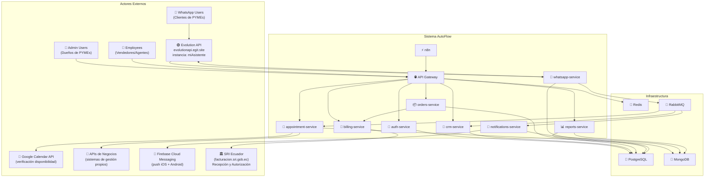
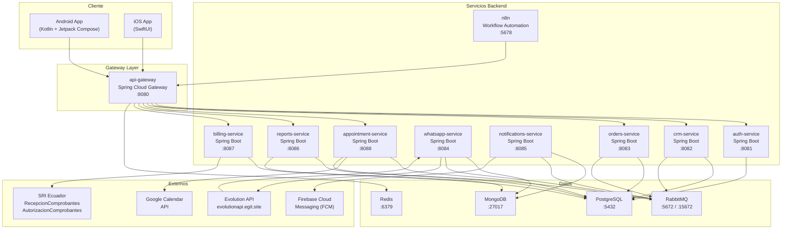
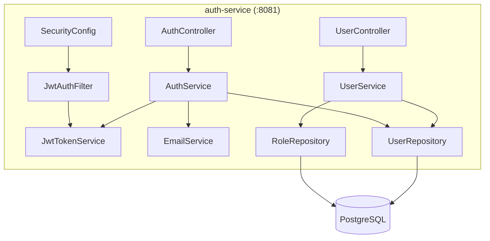
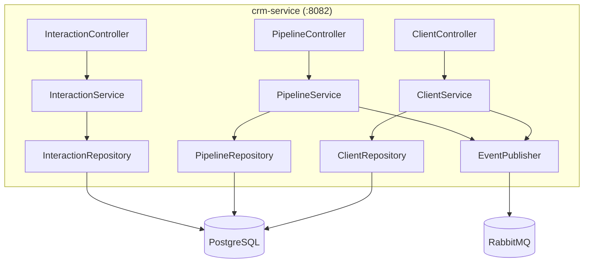

# ADR-002: Arquitectura de Microservicios — AutoFlow

| Campo | Valor |
|-------|-------|
| **Estado** | ✅ Aprobado — Eduardo Guerra, 2026-03-17 |
| **Fecha** | 2026-03-16 |
| **Última revisión** | 2026-03-17 (Archy — v2.3: billing-service para Facturación Electrónica SRI, Epic 9+10) |
| **Decisor** | Eduardo (CEO) |
| **Arquitecto** | Archy — Arquitecto en Jefe, EGIT |
| **Proyecto** | AutoFlow — Plataforma de CRM + WhatsApp para PYMEs ecuatorianas |

---

## Historial de Versiones

| Versión | Fecha | Autor | Descripción |
|---------|-------|-------|-------------|
| 2.0 | 2026-03-16 | Archy | Reescritura completa con arquitectura de microservicios |
| 2.1 | 2026-03-17 | Archy | Audit de completitud: resolución de 6 gaps arquitecturales |
| **2.2** | **2026-03-17** | **Archy** | **4 cambios por revisión de Eduardo: (1) whatsapp-service migrado a Evolution API self-hosted; (2) FCM especificado como proveedor de push notifications; (3) Sección de Especificaciones Funcionales y Técnicas iniciales; (4) Nuevo módulo appointment-service (citas)** |
| **2.3** | **2026-03-17** | **Archy** | **Nuevo microservicio billing-service (puerto 8087) para Facturación Electrónica SRI — Epics 9 y 10. Appointment-service reasignado a puerto 8088. Eventos RabbitMQ para facturación. N8N webhook para prospectos del chatbot.** |

---

## Contexto

AutoFlow es una plataforma SaaS orientada a PYMEs ecuatorianas que combina CRM, gestión de pedidos y automatización vía WhatsApp. Tras evaluación del CTO, se descarta la arquitectura monolítica inicial y se adopta **microservicios desde el MVP** por las siguientes razones:

- **Escalabilidad independiente**: el canal WhatsApp tendrá tráfico desproporcionado vs. el panel de reportes.
- **Despliegue independiente**: un bug en `whatsapp-service` no debe inmovilizar `orders-service`.
- **Equipo distribuido**: permite que desarrolladores trabajen en servicios aislados en paralelo.
- **Tecnología heterogénea**: MongoDB para mensajes, PostgreSQL para datos transaccionales.

### Decisiones clave previas (ADR-001)

- Apps nativas: Android (Kotlin + Jetpack Compose), iOS (SwiftUI)
- Backend: Spring Boot (Kotlin/Java)
- Automatización: N8N
- Despliegue MVP: Docker Compose en VPS propio

---

## 0. Especificaciones Funcionales y Técnicas Iniciales

> Sección añadida en v2.2 por revisión de Eduardo. Define el contrato funcional y técnico del sistema antes del primer sprint.

### 0.1 Especificaciones Funcionales

#### ¿Qué hace AutoFlow?

AutoFlow es una plataforma multi-tenant SaaS que permite a PYMEs ecuatorianas:

1. **Gestionar relaciones con clientes (CRM):** Centralizar contactos, historial de interacciones, pipeline de ventas y segmentación de clientes.
2. **Procesar pedidos:** Crear, confirmar y dar seguimiento a pedidos desde WhatsApp o el panel de administración.
3. **Automatizar comunicación vía WhatsApp:** Enviar y recibir mensajes mediante Evolution API (middleware self-hosted), con soporte para plantillas, catálogos y flujos conversacionales.
4. **Gestionar citas (nuevo):** Permitir a negocios como restaurantes, barberías, consultorios y clínicas que sus clientes reserven citas con verificación de disponibilidad en tiempo real.
5. **Enviar notificaciones multicanal:** Email, WhatsApp (Evolution API) y push notifications (Firebase Cloud Messaging) para iOS y Android.
6. **Automatizar flujos de negocio:** Mediante N8N, los clientes pueden configurar automatizaciones sin código (recordatorios, seguimientos, actualizaciones de estado).
7. **Reportar y analizar:** Dashboard con KPIs de ventas, métricas de WhatsApp, conversión y retención.

#### Módulos Principales

| Módulo | Descripción | Servicio |
|--------|-------------|---------|
| **Autenticación y Usuarios** | Login, registro, JWT, RBAC, multi-tenancy | `auth-service` |
| **CRM** | Clientes, interacciones, pipeline de ventas | `crm-service` |
| **Pedidos** | Creación, estados, facturación, catálogo | `orders-service` |
| **WhatsApp** | Mensajería vía Evolution API, conversaciones | `whatsapp-service` |
| **Citas** | Reservas, disponibilidad, recordatorios | `appointment-service` |
| **Notificaciones** | Email, Push (FCM), WhatsApp | `notifications-service` |
| **Reportes** | Dashboard, KPIs, exportaciones | `reports-service` |
| **Facturación Electrónica (SRI)** | XML firmado, autorización SRI, retenciones, notas de crédito, QR | `billing-service` *(nuevo)* |
| **Configuración Facturación** | Datos contribuyente, certificados .p12, Vault, proveedores | `billing-service` |
| **Automatización** | Flujos configurables por cliente | `n8n` |

#### Flujos Básicos

**Flujo 1 — Cliente envía mensaje WhatsApp:**
```
Cliente WhatsApp → Evolution API (evolutionapi.egit.site)
  → webhook POST al whatsapp-service
  → guarda en MongoDB
  → publica evento `message.received` en RabbitMQ
  → crm-service actualiza historial de interacciones
  → notifications-service notifica al agente responsable (Push FCM)
```

**Flujo 2 — Creación de pedido:**
```
Agente en App → API Gateway → orders-service
  → crea pedido en PostgreSQL
  → publica evento `order.created` en RabbitMQ
  → notifications-service envía confirmación (WhatsApp + email)
  → n8n dispara automatizaciones configuradas
```

**Flujo 3 — Reserva de cita:**
```
Cliente → API Gateway → appointment-service
  → verifica disponibilidad (Google Calendar API / sistema propio del negocio)
  → crea cita en PostgreSQL
  → confirma vía WhatsApp (Evolution API) + Push (FCM)
  → programa recordatorios automáticos (N8N o scheduler interno)
```

**Flujo 4 — Notificación push a app móvil:**
```
Evento interno (mensaje nuevo, cita, pedido)
  → notifications-service
  → Firebase Cloud Messaging (FCM)
  → App Android (Firebase SDK) / App iOS (APNs via FCM)
```

### 0.2 Especificaciones Técnicas

#### Performance

| Métrica | Objetivo MVP | Objetivo v2 |
|---------|-------------|------------|
| **Latencia p95** | < 500ms (endpoints críticos) | < 200ms |
| **Latencia p99** | < 1000ms | < 500ms |
| **Throughput** | 100 req/seg por servicio | 500 req/seg |
| **Mensajes WhatsApp** | 1.000 mensajes/hora por tenant | 10.000 mensajes/hora |
| **Citas procesadas** | 500 reservas/hora por tenant | 5.000 reservas/hora |
| **Tiempo arranque servicio** | < 30 segundos | < 15 segundos |

#### Disponibilidad

| Componente | SLA MVP | SLA v2 | Estrategia |
|------------|---------|---------|-----------|
| **API Gateway** | 99.5% | 99.9% | Restart automático, health checks |
| **auth-service** | 99.5% | 99.9% | Sesiones en Redis, failover rápido |
| **whatsapp-service** | 99.5% | 99.9% | Cola RabbitMQ (mensajes no se pierden) |
| **appointment-service** | 99% | 99.5% | Idempotencia en creación de citas |
| **Base de datos** | 99.5% | 99.9% | Backups diarios, pg_standby en v2 |
| **Evolution API** | Externo (EGIT) | — | Monitoreo en evolutionapi.egit.site |

- **RPO (Recovery Point Objective):** 24 horas (MVP)
- **RTO (Recovery Time Objective):** 2 horas (MVP)
- **Mantenimiento planificado:** Ventana: domingos 02:00–04:00 GMT-5

#### Seguridad

- **Autenticación:** JWT RSA-256 (access 15min + refresh 7 días)
- **Autorización:** RBAC con roles `admin`, `manager`, `employee`
- **Multi-tenancy:** Aislamiento completo por `tenant_id` en todas las queries
- **Transporte:** HTTPS/TLS 1.3 en todos los endpoints públicos
- **Secretos:** `.env` con permisos `600` en MVP; HashiCorp Vault en v3
- **Evolution API:** Autenticación vía API Key (`EVOLUTION_API_KEY`) + webhook secret (`EVOLUTION_WEBHOOK_SECRET`)
- **FCM:** Server Key almacenada como secret (`FCM_SERVER_KEY`), nunca en cliente
- **Google Calendar API:** Service Account con permisos mínimos (solo `calendar.readonly` + `calendar.events` por tenant)
- **Rate limiting:** 100 req/min por tenant vía Redis en API Gateway
- **Auditoría:** Todos los eventos de negocio logueados en MongoDB (`audit_logs`)

#### Escalabilidad

| Eje | Estrategia MVP | Estrategia v2+ |
|-----|---------------|---------------|
| **Vertical** | VPS con 4 vCPU / 8 GB RAM | Upgrade automático |
| **Horizontal** | Docker Compose, 1 réplica por servicio | Kubernetes + HPA |
| **Base de datos** | Single instance PostgreSQL + MongoDB | Read replicas, sharding MongoDB |
| **Mensajería** | RabbitMQ single node | RabbitMQ cluster / migración a Kafka |
| **Cache** | Redis single node | Redis Cluster |
| **WhatsApp** | 1 instancia Evolution API | Múltiples instancias por volumen |
| **Citas** | appointment-service single | Réplicas por demanda (stateless) |

**Criterios de escala horizontal (triggers):**
- CPU sostenido > 70% por 5 minutos → escalar
- Latencia p95 > 800ms sostenida → revisar cuellos de botella
- Cola RabbitMQ > 10.000 mensajes pendientes → escalar consumidores

---

## 1. Servicios de Microservicios

### 1.1 Visión General

```
┌─────────────────────────────────────────────────────────────┐
│                      USUARIOS FINALES                       │
│         (App Android · App iOS · Web Dashboard)             │
└──────────────────────┬──────────────────────────────────────┘
                       │ HTTPS (443)
                       ▼
              ┌─────────────────┐
              │   API GATEWAY   │  Spring Cloud Gateway
              │   (Puerto 8080) │  Routing · Rate Limiting · Auth Filter
              └────────┬────────┘
                       │
        ┌──────────────┼──────────────┬──────────────┐
        ▼              ▼              ▼              ▼
┌──────────────┐ ┌──────────┐ ┌──────────────┐ ┌──────────────┐
│ auth-service │ │crm-service│ │orders-service│ │whatsapp-svc  │
│  (8081)      │ │  (8082)  │ │   (8083)     │ │   (8084)     │
│ PostgreSQL   │ │PostgreSQL│ │ PostgreSQL   │ │  MongoDB     │
└──────────────┘ └──────────┘ └──────────────┘ └──────────────┘
┌──────────────┐ ┌──────────────┐ ┌──────────────┐ ┌───────┐
│appointment-  │ │notifications-│ │reports-svc   │ │  N8N  │
│   svc (8088) │ │   svc (8085) │ │   (8086)     │ │(5678) │
│  PostgreSQL  │ │  MongoDB     │ │ PG + MongoDB │ │       │
└──────────────┘ └──────────────┘ └──────────────┘ └───────┘
┌──────────────┐
│billing-svc   │
│   (8087)     │
│ PostgreSQL   │
└──────────────┘

                    ┌────────────────────────────┐
                    │  Evolution API (external)  │
                    │  evolutionapi.egit.site     │
                    │  instancia: miAsistente     │
                    │  número: 593984526396       │
                    └────────────────────────────┘
```

### 1.2 Detalle por Servicio

#### `api-gateway` — Puerta de Entrada

- **Framework:** Spring Cloud Gateway (WebFlux reactivo)
- **Responsabilidades:**
  - Routing dinámico a todos los microservicios
  - Rate limiting por cliente (Redis-backed, token bucket)
  - Autenticación global (valida JWT antes de enrutar)
  - Load balancing entre instancias
  - CORS centralizado
  - Logging de requests
- **Base de datos:** Redis (rate limiting + cache de tokens)
- **Puerto:** `8080`

#### `auth-service` — Autenticación y Usuarios

- **Framework:** Spring Boot 3 + Spring Security
- **Base de datos:** PostgreSQL
- **Responsabilidades:**
  - Registro / Login de usuarios
  - Gestión de usuarios (CRUD completo)
  - Roles y permisos (RBAC)
  - Generación y validación de JWT (access + refresh tokens)
  - Gestión de tenants (multi-tenancy)
  - Password reset / email verification
- **Endpoints:**
  - `POST /auth/login`
  - `POST /auth/register`
  - `POST /auth/refresh`
  - `GET /auth/me`
  - `GET /users`, `PUT /users/{id}`, `DELETE /users/{id}`
- **Puerto:** `8081`

#### `crm-service` — Gestión de Clientes

- **Framework:** Spring Boot 3 + Spring Data JPA
- **Base de datos:** PostgreSQL
- **Responsabilidades:**
  - CRUD de clientes (contactos, empresas)
  - Historial de interacciones (llamadas, mensajes, emails)
  - Pipeline de ventas (etapas personalizables)
  - Segmentación de clientes
  - Etiquetado y búsqueda avanzada
- **Endpoints:**
  - `GET/POST /crm/clients`
  - `GET/PUT/DELETE /crm/clients/{id}`
  - `GET /crm/clients/{id}/interactions`
  - `GET/POST /crm/pipeline`
  - `POST /crm/clients/{id}/tags`
- **Puerto:** `8082`

#### `orders-service` — Pedidos y Facturación

- **Framework:** Spring Boot 3 + Spring Data JPA
- **Base de datos:** PostgreSQL
- **Responsabilidades:**
  - Creación y gestión de pedidos
  - Flujo de estados: `DRAFT → PENDING → CONFIRMED → SHIPPED → DELIVERED → CANCELLED`
  - Catálogo de productos / inventario básico
  - Facturación y generación de PDFs
  - Historial de pedidos por cliente
- **Endpoints:**
  - `GET/POST /orders`
  - `GET/PUT/DELETE /orders/{id}`
  - `PUT /orders/{id}/status`
  - `GET/POST /products`
  - `GET /orders/{id}/invoice`
- **Puerto:** `8083`

#### `whatsapp-service` — Integración WhatsApp vía Evolution API *(actualizado v2.2)*

> **Cambio v2.2:** Migrado de WhatsApp Business API directa (Meta) a **Evolution API self-hosted**. EGIT ya tiene una instancia activa en `evolutionapi.egit.site` — instancia `miAsistente`, número `593984526396`. Este servicio se comunica exclusivamente con la Evolution API como middleware entre AutoFlow y WhatsApp.

- **Framework:** Spring Boot 3 + Spring Data MongoDB
- **Base de datos:** MongoDB
- **Middleware externo:** Evolution API — `evolutionapi.egit.site`
  - Instancia activa: `miAsistente`
  - Número WhatsApp: `593984526396`
  - Autenticación: API Key (`EVOLUTION_API_KEY`)
  - Webhook secret: `EVOLUTION_WEBHOOK_SECRET`

**Arquitectura de comunicación:**
```
WhatsApp (Meta)
    ↕
Evolution API (evolutionapi.egit.site)
  instancia: miAsistente | número: 593984526396
    ↕  webhooks + REST API
whatsapp-service (AutoFlow :8084)
    ↕
RabbitMQ → otros microservicios
```

- **Responsabilidades:**
  - Recepción de webhooks de Evolution API (mensajes entrantes, estados de entrega)
  - Envío de mensajes salientes vía REST API de Evolution API
  - Gestión de plantillas de mensajes por tenant
  - Almacenamiento de historial de conversaciones en MongoDB
  - Publicación de eventos a RabbitMQ (`message.received`, `message.delivered`)
  - Manejo de medios (imágenes, documentos, audio) via MinIO
  - Soporte para catálogo de productos en WhatsApp (vía Evolution API)

- **Endpoints:**
  - `POST /webhook/evolution` — webhook entrante desde Evolution API
  - `POST /whatsapp/send` — envío de mensaje saliente
  - `POST /whatsapp/send/media` — envío de mensaje con archivo adjunto
  - `GET/POST /whatsapp/templates` — gestión de plantillas
  - `GET /whatsapp/catalog` — catálogo de productos
  - `GET /whatsapp/conversations` — historial de conversaciones
  - `GET /whatsapp/conversations/{id}/messages` — mensajes de una conversación

- **Puerto:** `8084`

**Configuración Evolution API (variables de entorno):**

```
EVOLUTION_API_BASE_URL=https://evolutionapi.egit.site
EVOLUTION_API_KEY=<api-key-secreta>
EVOLUTION_INSTANCE_NAME=miAsistente
EVOLUTION_INSTANCE_NUMBER=593984526396
EVOLUTION_WEBHOOK_SECRET=<webhook-secret>
EVOLUTION_WEBHOOK_URL=https://autoflow.egit.site/api/v1/webhook/evolution
```

#### `appointment-service` — Sistema de Citas *(reasinado a :8088 en v2.3)*

> **Nuevo módulo v2.2.** Gestión completa de citas para negocios como restaurantes, barberías, consultorios y clínicas. Verifica disponibilidad en tiempo real vía Google Calendar API y/o APIs propias del negocio cliente.

- **Framework:** Spring Boot 3 + Spring Data JPA
- **Base de datos:** PostgreSQL
- **Integraciones externas:**
  - **Google Calendar API** — verificación y sincronización de disponibilidad
  - **APIs propias de terceros** — sistemas de gestión internos de los negocios clientes (adaptadores configurables por tenant)

**Flujo completo de reserva:**
```
1. Cliente solicita cita (vía WhatsApp o App)
      ↓
2. appointment-service recibe solicitud
      ↓
3. Verificación de disponibilidad (en paralelo cuando aplica):
   ├── Google Calendar API (GET /calendars/{calendarId}/freebusy)
   └── API propia del negocio (adaptador configurable por tenant)
      ↓
4. Si disponible → crea cita en PostgreSQL (estado: CONFIRMED)
   Si no disponible → sugiere próximos slots disponibles
      ↓
5. Notificaciones de confirmación:
   ├── WhatsApp: whatsapp-service → Evolution API (evolutionapi.egit.site)
   └── Push: notifications-service → Firebase Cloud Messaging (FCM)
      ↓
6. Programa recordatorios automáticos (N8N o scheduler interno)
   ├── Recordatorio 24h antes → WhatsApp + Push
   └── Recordatorio 2h antes → Push
```

- **Responsabilidades:**
  - CRUD completo de citas por tenant
  - Configuración de horarios de atención por negocio (días, horas, excepciones)
  - Gestión de duración de turnos por tipo de servicio
  - Verificación de disponibilidad en tiempo real (Google Cal + sistema propio)
  - Sincronización bidireccional con Google Calendar (crear, actualizar, cancelar)
  - Adaptadores de integración para APIs propias de terceros (configurables por tenant)
  - Gestión de cancelaciones (política por negocio: con qué antelación, penalizaciones)
  - Programación de recordatorios automáticos
  - Historial de citas por cliente y por negocio

- **Endpoints:**
  - `GET/POST /appointments` — listar y crear citas
  - `GET/PUT/DELETE /appointments/{id}` — gestión individual
  - `PUT /appointments/{id}/cancel` — cancelar con motivo
  - `PUT /appointments/{id}/reschedule` — reprogramar
  - `GET /appointments/availability?date=&serviceId=` — consultar disponibilidad
  - `GET/POST /appointments/schedules` — horarios de atención del negocio
  - `GET/POST /appointments/services` — tipos de servicio (duración, nombre, precio)
  - `GET /appointments/upcoming` — próximas citas (para recordatorios)

- **Puerto:** `8088`

**Reglas de negocio:**

| Regla | Descripción |
|-------|-------------|
| **Horarios** | Cada tenant configura días y horas de atención. Soporte para excepciones (feriados, vacaciones). |
| **Duración de turnos** | Configurable por tipo de servicio (ej: corte 30min, consulta 45min, reserva mesa 90min). |
| **Buffer entre citas** | Tiempo de limpieza/preparación configurable entre turnos (ej: 10min). |
| **Anticipación mínima** | Tiempo mínimo de anticipación para reservar (ej: mínimo 2 horas antes). |
| **Anticipación máxima** | Ventana máxima de reserva (ej: hasta 30 días en adelante). |
| **Cancelaciones** | Política configurable: libre hasta X horas antes, luego requiere autorización. |
| **No-shows** | Registro de inasistencias para analytics y posibles restricciones futuras. |
| **Recordatorios** | Automáticos: 24h antes (WhatsApp + Push) y 2h antes (Push). Configurables por tenant. |
| **Doble reserva** | Lock optimista en PostgreSQL para evitar race conditions al confirmar disponibilidad. |
| **Sincronización Google Cal** | Cita confirmada → evento en Google Calendar del negocio. Cancelación → eliminar evento. |

**Configuración de integración (variables de entorno):**

```
GOOGLE_CALENDAR_SERVICE_ACCOUNT_JSON=<path-al-archivo-o-contenido-json>
GOOGLE_CALENDAR_DELEGATED_USER=<email-del-negocio>  # Por tenant, en DB
```

**Modelo de datos clave (PostgreSQL):**

```sql
-- Citas
appointments (id, tenant_id, client_id, service_id, staff_id,
              start_time, end_time, status, google_calendar_event_id,
              external_booking_id, notes, created_at, updated_at)

-- Servicios ofrecidos por el negocio
appointment_services (id, tenant_id, name, duration_minutes,
                      buffer_minutes, price, active)

-- Horarios de atención
business_schedules (id, tenant_id, day_of_week, open_time, close_time,
                    is_closed, valid_from, valid_until)

-- Configuración de integración por tenant
tenant_integrations (id, tenant_id, integration_type,  -- 'google_calendar' | 'custom_api'
                     config_json, active)
```

#### `notifications-service` — Notificaciones Multi-canal *(actualizado v2.2)*

> **Actualizado v2.2:** Se especifica **Firebase Cloud Messaging (FCM)** como proveedor oficial de push notifications para iOS y Android.

- **Framework:** Spring Boot 3 + Spring Data MongoDB
- **Base de datos:** MongoDB
- **Proveedores de notificación:**
  - **Email:** SMTP / SendGrid / AWS SES (configurable por tenant)
  - **Push iOS + Android:** **Firebase Cloud Messaging (FCM)** — Firebase Admin SDK
  - **WhatsApp:** via `whatsapp-service` → Evolution API

**Integración FCM:**
- SDK: `firebase-admin` Java SDK (versión 9.x+)
- Credenciales: Service Account JSON (`FCM_SERVICE_ACCOUNT_JSON`)
- Soporte: notificaciones individuales, por topic y multicast (hasta 500 tokens)
- Plataformas: Android nativo (Firebase SDK) + iOS (APNs vía FCM)
- Payload: `title`, `body`, `data` (payload estructurado), `imageUrl`, `priority`
- Tracking: Firebase entrega confirmaciones de envío; se almacenan en `notifications_log`

- **Responsabilidades:**
  - Envío de emails (SMTP / SendGrid / SES)
  - Push notifications via Firebase Cloud Messaging (FCM) para iOS y Android
  - Notificaciones WhatsApp (delega a `whatsapp-service`)
  - Cola de notificaciones pendientes
  - Retry con backoff exponencial (max 3 reintentos)
  - Plantillas de notificaciones (HTML, push, WhatsApp) por tenant
  - Registro de envíos y estadísticas de entrega
  - Gestión de tokens FCM (registro, actualización, eliminación de tokens expirados)

- **Endpoints:**
  - `POST /notifications/send`
  - `GET /notifications/{id}/status`
  - `GET/POST /notifications/templates`
  - `POST /notifications/fcm/register-token` — registrar dispositivo móvil
  - `DELETE /notifications/fcm/token/{token}` — dar de baja dispositivo
- **Puerto:** `8085`

**Variables de entorno FCM:**

```
FCM_SERVICE_ACCOUNT_JSON=<path-al-service-account.json>
FCM_PROJECT_ID=<firebase-project-id>
```

#### `reports-service` — Dashboard y Analytics

- **Framework:** Spring Boot 3 + Spring Data JPA + Spring Data MongoDB
- **Base de datos:** PostgreSQL + MongoDB (consulta cruzada)
- **Responsabilidades:**
  - KPIs del negocio (ventas, conversión, retención)
  - Reportes de actividad por usuario
  - Métricas de WhatsApp (mensajes enviados/recibidos, tiempos de respuesta)
  - Métricas de citas (reservas, cancelaciones, no-shows, tasa de ocupación)
  - Exportación a CSV/PDF
  - Dashboard data para las apps móviles
- **Endpoints:**
  - `GET /reports/dashboard`
  - `GET /reports/sales`
  - `GET /reports/whatsapp-metrics`
  - `GET /reports/appointments-metrics`
  - `GET /reports/export?format=csv|pdf`
- **Puerto:** `8086`

#### `billing-service` — Facturación Electrónica SRI *(NUEVO — v2.3)*

> **Nuevo módulo v2.3.** Generación de comprobantes electrónicos conforme a la normativa del SRI de Ecuador. Cubre Epics 9 y 10: facturas, notas de crédito, comprobantes de retención, firma electrónica con certificado .p12, integración con web services del SRI, generación de clave de acceso de 49 dígitos y generación de código QR para validación.

- **Framework:** Spring Boot 3 + Spring Data JPA + XML Digital Signature (Apache XML Security / BouncyCastle)
- **Base de datos:** PostgreSQL
- **Integraciones externas:**
  - **SRI (Servicio de Rentas Internas)** — Recepción y autorización de comprobantes electrónicos
    - Pruebas: `https://celcer.sri.gob.ec/comprobantes-electronicos-ws/RecepcionComprobantesOffline`
    - Producción: `https://cel.sri.gob.ec/comprobantes-electronicos-ws/RecepcionComprobantesOffline`
  - **HashiCorp Vault** — Almacenamiento seguro de certificados .p12 y contraseñas (producción)
  - **Docker Secrets** — Almacenamiento de certificados (staging)
  - **Proveedores de firma electrónica** — BCE, Security Data (SDS), ANF Ecuador, Ecuacert, GlobalSign, DigiCert

**Flujo completo de facturación electrónica:**
```
1. orders-service crea pedido confirmado → evento order.confirmed en RabbitMQ
      ↓
2. billing-service consume evento order.confirmed
      ↓
3. Recupera datos del contribuyente (configuración del tenant)
   ├── Datos del emisor: RUC, razón social, dirección, establecimiento, punto de emisión
   ├── Certificado .p12 desde Vault/Docker Secrets
   └── Configuración fiscal del tenant (ambiente: prueba/producción)
      ↓
4. Genera clave de acceso de 49 dígitos (algoritmo SRI)
      ↓
5. Genera XML del comprobante (factura, nota de crédito o retención)
   └── Valida estructura contra XSD oficial del SRI
      ↓
6. Firma electrónica del XML con certificado .p12 (RSA-SHA256)
      ↓
7. Envía XML firmado al web service del SRI (RecepcionComprobantes)
   ├── Si AUTORIZADO → almacena número de autorización + XML autorizado
   ├── Si RECHAZADO/DEVUELTO → almacena errores para corrección
   └── Reintentos automáticos con backoff (máx. 3 intentos)
      ↓
8. Genera PDF de factura con código QR de validación SRI
      ↓
9. Almacena en MinIO: invoices/{tenantId}/{year}/{month}/{claveAcceso}.xml/pdf
      ↓
10. Notifica al tenant: factura autorizada (push FCM + email + WhatsApp)
```

- **Responsabilidades:**
  - Generación de claves de acceso de 49 dígitos según algoritmo del SRI
  - Generación de XML de comprobantes: facturas (tipo 1), notas de crédito (tipo 4), comprobantes de retención (tipo 7)
  - Firma electrónica de XML con certificados PKCS#12 (.p12/.pfx)
  - Integración con web services del SRI (recepción y autorización)
  - Gestión de certificados digitales (subida, validación de vigencia, rotación)
  - Almacenamiento seguro de credenciales en HashiCorp Vault (producción) / Docker Secrets (staging)
  - Generación de facturas PDF con QR de validación
  - Gestión de secuenciales por establecimiento + punto de emisión
  - Gestión de ambientes (pruebas / producción)
  - Configuración de proveedores de firma electrónica
  - Consumo de eventos `order.confirmed` desde RabbitMQ para auto-facturación
  - Publicación de eventos `invoice.authorized`, `invoice.voided` en RabbitMQ

- **Endpoints:**
  - `POST /api/v1/invoices/generate` — generar factura electrónica con clave de acceso
  - `POST /api/v1/invoices/{id}/sign` — firmar XML electrónicamente
  - `POST /api/v1/invoices/{id}/send-to-sri` — enviar comprobante al SRI para autorización
  - `GET /api/v1/invoices/{id}/authorized-xml` — obtener XML autorizado por el SRI
  - `GET /api/v1/invoices/{id}/qr` — generar código QR para validación
  - `POST /api/v1/invoices/{invoiceId}/credit-note` — generar nota de crédito electrónica
  - `POST /api/v1/invoices/{invoiceId}/withholding` — generar comprobante de retención
  - `GET/POST /api/v1/billing/config` — configuración fiscal del contribuyente (Epic 10)
  - `POST /api/v1/billing/certificate/upload` — subir certificado .p12/.pfx
  - `POST /api/v1/billing/rotate-certificate` — rotar certificado sin downtime
  - `GET/POST /api/v1/billing/providers` — gestión de proveedores de firma
  - `POST /api/v1/billing/environment/switch` — cambiar ambiente (pruebas ↔ producción)

- **Puerto:** `8087`

**Variables de entorno:**

```
BILLING_SRI_ENVIRONMENT=prueba|produccion
BILLING_SRI_RECEPTION_URL=https://celcer.sri.gob.ec/comprobantes-electronicos-ws/RecepcionComprobantesOffline
BILLING_SRI_AUTHORIZATION_URL=https://celcer.sri.gob.ec/comprobantes-electronicos-ws/AutorizacionComprobantesOffline
VAULT_URL=http://autoflow-vault:8200          # HashiCorp Vault (producción)
VAULT_TOKEN=<root-token>                       # Token de Vault
BILLING_CERT_PATH=secret/data/billing/{tenant_id}/certificate
BILLING_CERT_PASS_PATH=secret/data/billing/{tenant_id}/certificate_password
BILLING_SIGNING_PROVIDER=BCE|SDS|ANF|ECUACERT|GLOBALSIGN|DIGICERT
BILLING_QR_BASE_URL=https://verififact.sri.gob.ec/cgi-bin/cfaces/CeFacSWSPLE?cmp=
```

**Modelo de datos clave (PostgreSQL):**

```sql
-- Comprobantes electrónicos
invoices (id, tenant_id, order_id, invoice_type, clave_acceso, secuencial,
          establishment_code, emission_point, invoice_date, subtotal, iva,
          ice, ir, total, status, sri_authorization_number,
          sri_authorization_date, sri_environment, sri_status, created_at, updated_at)

-- Detalle de ítems de factura
invoice_items (id, invoice_id, product_code, description, quantity,
               unit_price, subtotal, iva_rate, ice_rate)

-- Notas de crédito
credit_notes (id, tenant_id, invoice_id_original, clave_acceso_original,
              clave_acceso_nota, secuencial, motivo, total_abonado, status)

-- Comprobantes de retención
withholding_receipts (id, tenant_id, invoice_id, clave_acceso,
                      secuencial, periodo_fiscal, total_retenido, status)

-- Configuración fiscal del contribuyente (Epic 10)
tenant_billing_config (id, tenant_id, ruc, razon_social, nombre_comercial,
                       direccion_matricial, establecimiento, punto_emision,
                       tipo_contribuyente, ambiente_sri, signing_provider)

-- Logs de interacción con SRI
invoice_sri_logs (id, invoice_id, action, request_xml, response_xml,
                  sri_status, sri_messages, attempt, created_at)
```

#### `n8n` — Automatización de Flujos

- **Framework:** N8N (instancia Docker self-hosted)
- **Responsabilidades:**
  - Flujos automatizados configurables por cliente
  - Integraciones: email, SMS, CRM, WhatsApp (Evolution API), calendarios, citas
  - Webhooks personalizados para disparar flujos
  - Plantillas de automatización pre-construidas
  - Recordatorios de citas programados (alternativa al scheduler interno)
- **Comunicación:** Consume APIs de los otros servicios vía HTTP
- **Webhooks entrantes:**
  - `/webhook/n8n/prospects` — Recepción de prospectos del chatbot (integración con `crm-service` para crear/actualizar clientes)
  - `/webhook/n8n/invoice-reminders` — Recordatorios de facturación pendiente
  - `/webhook/n8n/appointment-reminders` — Recordatorios de citas (24h antes y 2h antes)
- **Puerto:** `5678`

---

## 2. Comunicación entre Microservicios

### 2.1 Sincrónica (REST API)

- Comunicación directa vía HTTP/REST cuando se necesita respuesta inmediata.
- El `api-gateway` es el **único punto de entrada** externo.
- Inter-servicio: solo cuando es necesario (ej: `orders-service` consulta `crm-service` para validar cliente).
- OpenFeign o WebClient para declarative HTTP calls.

### 2.2 Asíncrona (RabbitMQ)

**Colas y eventos clave:**

| Evento | Publicado por | Consumido por |
|--------|---------------|---------------|
| `message.received` | whatsapp-service | crm-service, notifications-service |
| `message.delivered` | whatsapp-service | crm-service |
| `order.created` | orders-service | notifications-service, n8n |
| `order.status_changed` | orders-service | notifications-service, whatsapp-service |
| `user.registered` | auth-service | notifications-service |
| `client.updated` | crm-service | reports-service |
| `appointment.created` | appointment-service | notifications-service, whatsapp-service, n8n |
| `appointment.confirmed` | appointment-service | notifications-service, whatsapp-service |
| `appointment.cancelled` | appointment-service | notifications-service, whatsapp-service, n8n |
| `appointment.reminder` | appointment-service / n8n | notifications-service, whatsapp-service |
| `order.confirmed` | orders-service | billing-service (auto-facturación) |
| `invoice.authorized` | billing-service | notifications-service, whatsapp-service, crm-service |
| `invoice.voided` | billing-service | notifications-service, whatsapp-service |
| `prospect.received` | n8n (webhook chatbot) | crm-service (crear/actualizar cliente) |

**Exchange:** Topic exchange `autoflow.events`

### 2.3 API Gateway como punto de entrada único

```
Cliente ──HTTPS──▶ API Gateway ──HTTP──▶ Microservicio
                     │
                     ├─ Auth Filter (valida JWT)
                     ├─ Rate Limiter (Redis)
                     └─ Load Balancer
```

---

## 3. Diseño de Datos

### 3.1 PostgreSQL — Datos Estructurados

**Tabla de decisiones de asignación:**

| Entidad | Servicio | Justificación |
|---------|----------|---------------|
| `users`, `roles`, `permissions` | auth-service | Datos de identidad, transaccional, referencialidad fuerte |
| `clients`, `interactions`, `pipeline_stages`, `tags` | crm-service | Datos relacionales, joins complejos, queries por múltiples campos |
| `orders`, `order_items`, `products`, `invoices` | orders-service | Transaccional, integridad referencial (ACID), facturación |
| `appointments`, `appointment_services`, `business_schedules`, `tenant_integrations` | appointment-service | Transaccional, concurrencia crítica (doble reserva), ACID |
| `invoices`, `invoice_items`, `credit_notes`, `withholding_receipts`, `tenant_billing_config`, `invoice_sri_logs` | billing-service | Transaccional, datos fiscales, integridad legal de comprobantes, auditoría SRI |
| `report_snapshots` | reports-service | Datos agregados, time-series ligera |

### 3.2 MongoDB — Datos No Estructurados

| Colección | Servicio | Justificación |
|-----------|----------|---------------|
| `messages`, `conversations` | whatsapp-service | Schema flexible, mensajes con estructura variable, volumen alto |
| `templates` | whatsapp-service, notifications-service | JSON flexible, varies por tenant |
| `notifications_log` | notifications-service | Log de envíos (email, FCM push, WhatsApp), estructura según tipo |
| `fcm_tokens` | notifications-service | Tokens de dispositivos FCM, TTL automático para expirados |
| `audit_logs` | todos los servicios | Eventos de auditoría, estructura heterogénea |
| `report_cache` | reports-service | Cache de reportes complejos, TTL automático |

### 3.3 Redis — Cache y Sesiones

- Cache de tokens JWT revocados
- Sesiones de rate limiting
- Cache de datos frecuentemente consultados (catálogo, config, slots disponibles)
- Distributed locks para operaciones críticas (evitar doble reserva en citas)

---

## 4. Diagramas C4 (Mermaid)

### 4.1 Context Diagram — Nivel 1



### 4.2 Container Diagram — Nivel 2



### 4.3 Component Diagram — auth-service



### 4.4 Component Diagram — crm-service



---

## 5. Seguridad

### 5.1 Autenticación — JWT con Refresh Tokens

```
┌─────────┐        ┌──────────────┐        ┌──────────────┐
│  Client  │──Login─▶ auth-service │──Token─▶   Client     │
│  (App)   │        │              │        │ (Access+Refresh) │
└─────────┘        └──────────────┘        └──────┬───────┘
                                                   │
         ┌─────────────────────────────────────────┘
         │  Request + Bearer Token
         ▼
┌──────────────┐   Token OK?   ┌──────────────┐
│ api-gateway  │───Yes───────▶ │ Microservicio│
│  (validate)  │               │              │
└──────────────┘               └──────────────┘
```

- **Access Token:** JWT firmado con RSA-256, expira en 15 minutos
- **Refresh Token:** JWT firmado con RSA-256, expira en 7 días, almacenado en BD
- **Revocación:** Refresh tokens mantienen una blocklist en Redis
- **Renovación:** `POST /auth/refresh` con refresh token válido

### 5.2 API Gateway como Auth Filter

- El gateway intercepta **todas** las requests excepto `/auth/login`, `/auth/register`, `/webhook/evolution`, `/webhook/n8n/*`
- Valida el JWT antes de enrutar al microservicio correspondiente
- Extrae claims (`userId`, `tenantId`, `roles`) y los pasa como headers:
  - `X-User-Id`
  - `X-Tenant-ID`
  - `X-User-Roles`
  - `X-Request-Id` (UUID para trazabilidad)

### 5.3 RBAC — Roles y Permisos

| Rol | Acceso |
|-----|--------|
| `admin` | Todo: usuarios, config, facturación, reports, eliminación |
| `manager` | CRM, orders, citas, reports, gestión de empleados |
| `employee` | CRM (solo clientes propios), orders (solo creación), WhatsApp, citas (solo gestión) |

**Permisos granulares** almacenados en tabla `permissions` y tabla pivote `user_roles` / `role_permissions`.

### 5.4 TLS Inter-servicio

- En producción: mTLS entre todos los microservicios
- En MVP (Docker Compose): TLS terminado en el gateway; comunicación interna en red Docker privada
- Certificados gestionados con `mkcert` para desarrollo, Let's Encrypt para producción

### 5.5 Multi-tenancy

- **Estrategia:** `X-Tenant-ID` header inyectado por el API Gateway
- Cada query incluye `WHERE tenant_id = ?` (PostgreSQL) o filtro por tenant (MongoDB)
- Los datos están completamente aislados entre tenants
- Un usuario no puede acceder datos de otro tenant

---

## 6. Despliegue

### 6.1 Arquitectura de Despliegue — Docker Compose

```
┌──────────────────────────────── VPS (Docker Compose) ────────────────────────────────┐
│                                                                                       │
│  ┌──────────┐ ┌──────────┐ ┌──────────┐ ┌──────────┐ ┌──────────┐ ┌──────────┐      │
│  │api-gate- │ │auth-svc  │ │crm-svc   │ │orders-svc│ │whatsapp- │ │notific-  │      │
│  │way :8080 │ │:8081     │ │:8082     │ │:8083     │ │svc :8084 │ │ations    │      │
│  └──────────┘ └──────────┘ └──────────┘ └──────────┘ └──────────┘ │svc :8085 │      │
│  ┌──────────┐ ┌──────────┐ ┌──────────┐ ┌──────────┐                              │
│  │reports-  │ │appoint-  │ │billing-  │ │  n8n     │                              │
│  │svc :8086 │ │ment :8088│ │svc :8087 │ │  :5678   │                              │
│  └──────────┘ └──────────┘ └──────────┘ └──────────┘                              │
│                                                                                       │
│  ┌──────────┐ ┌──────────┐ ┌──────────┐ ┌──────────┐ ┌──────────┐                  │
│  │PostgreSQL│ │ MongoDB  │ │  Redis   │ │ RabbitMQ │ │  MinIO   │                  │
│  │  :5432   │ │  :27017  │ │  :6379   │ │  :5672   │ │  :9000   │                  │
│  └──────────┘ └──────────┘ └──────────┘ └──────────┘ └──────────┘                  │
│                                                                                       │
│  ┌──────────────────────────────────────────────┐                                    │
│  │           Red Docker: autoflow-network        │                                    │
│  └──────────────────────────────────────────────┘                                    │
│                                                                                       │
│  [Externo] Evolution API — evolutionapi.egit.site (EGIT self-hosted)                │
│  [Externo] Firebase Cloud Messaging — push.googleapis.com                            │
│  [Externo] Google Calendar API — www.googleapis.com                                  │
└───────────────────────────────────────────────────────────────────────────────────────┘
```

### 6.2 Tabla de Puertos

| Servicio | Contenedor | Puerto Host | Puerto Contenedor | Protocolo |
|----------|-----------|-------------|-------------------|-----------|
| API Gateway | `autoflow-gateway` | `8080` | `8080` | HTTP |
| Auth Service | `autoflow-auth` | `8081` | `8081` | HTTP |
| CRM Service | `autoflow-crm` | `8082` | `8082` | HTTP |
| Orders Service | `autoflow-orders` | `8083` | `8083` | HTTP |
| WhatsApp Service | `autoflow-whatsapp` | `8084` | `8084` | HTTP |
| Notifications Service | `autoflow-notifications` | `8085` | `8085` | HTTP |
| Reports Service | `autoflow-reports` | `8086` | `8086` | HTTP |
| **Appointment Service** | **`autoflow-appointments`** | **`8088`** | **`8088`** | **HTTP** |
| **Billing Service** | **`autoflow-billing`** | **`8087`** | **`8087`** | **HTTP** |
| N8N | `autoflow-n8n` | `5678` | `5678` | HTTP |
| PostgreSQL | `autoflow-postgres` | `5432` | `5432` | TCP |
| MongoDB | `autoflow-mongo` | `27017` | `27017` | TCP |
| Redis | `autoflow-redis` | `6379` | `6379` | TCP |
| RabbitMQ | `autoflow-rabbitmq` | `5672` | `5672` | AMQP |
| RabbitMQ Management | `autoflow-rabbitmq` | `15672` | `15672` | HTTP |
| MinIO | `autoflow-minio` | `9000` | `9000` | HTTP |
| MinIO UI | `autoflow-minio` | `9001` | `9001` | HTTP |

### 6.3 Variables de Entorno Clave

| Variable | Servicio | Descripción |
|----------|----------|-------------|
| `SPRING_DATASOURCE_URL` | auth, crm, orders, reports, appointments | JDBC URL de PostgreSQL |
| `SPRING_DATA_MONGODB_URI` | whatsapp, notifications, reports | URI de MongoDB |
| `SPRING_REDIS_HOST` | gateway, todos | Host de Redis |
| `SPRING_RABBITMQ_HOST` | whatsapp, notifications, crm, orders, appointments, n8n | Host de RabbitMQ |
| `JWT_SECRET` | auth-service | Clave para firmar JWT (RSA-256) |
| `JWT_EXPIRATION` | auth-service | Duración access token (900000ms) |
| `EVOLUTION_API_BASE_URL` | whatsapp-service | URL base de Evolution API (`https://evolutionapi.egit.site`) |
| `EVOLUTION_API_KEY` | whatsapp-service | API Key de Evolution API |
| `EVOLUTION_INSTANCE_NAME` | whatsapp-service | Nombre de instancia (`miAsistente`) |
| `EVOLUTION_INSTANCE_NUMBER` | whatsapp-service | Número WhatsApp (`593984526396`) |
| `EVOLUTION_WEBHOOK_SECRET` | whatsapp-service | Secret para validar webhooks de Evolution API |
| `FCM_SERVICE_ACCOUNT_JSON` | notifications-service | Path o contenido del Service Account JSON de Firebase |
| `FCM_PROJECT_ID` | notifications-service | ID del proyecto Firebase |
| `GOOGLE_CALENDAR_SERVICE_ACCOUNT_JSON` | appointment-service | Service Account JSON para Google Calendar API |
| `BILLING_SRI_ENVIRONMENT` | billing-service | Ambiente SRI: `prueba` o `produccion` |
| `BILLING_SRI_RECEPTION_URL` | billing-service | URL del web service de recepción del SRI |
| `BILLING_SRI_AUTHORIZATION_URL` | billing-service | URL del web service de autorización del SRI |
| `VAULT_URL` | billing-service | URL de HashiCorp Vault (producción) |
| `VAULT_TOKEN` | billing-service | Token de acceso a Vault |
| `BILLING_CERT_PATH` | billing-service | Vault path para certificado .p12 |
| `BILLING_CERT_PASS_PATH` | billing-service | Vault path para contraseña del certificado |
| `BILLING_SIGNING_PROVIDER` | billing-service | Proveedor de firma: BCE, SDS, ANF, ECUACERT, GLOBALSIGN, DIGICERT |
| `N8N_ENCRYPTION_KEY` | n8n | Clave de encriptación de N8N |
| `MAIL_HOST` | notifications-service | Servidor SMTP |
| `APP_CORS_ALLOWED_ORIGINS` | gateway | Orígenes CORS permitidos |
| `MINIO_ENDPOINT` | whatsapp, orders | Endpoint de MinIO |
| `MINIO_ACCESS_KEY` | whatsapp, orders | Access key de MinIO |
| `MINIO_SECRET_KEY` | whatsapp, orders | Secret key de MinIO |

---

## 7. CI/CD Básico

### 7.1 Pipeline — GitHub Actions

```yaml
name: AutoFlow CI

on:
  push:
    branches: [main, develop]
  pull_request:
    branches: [main]

jobs:
  detect-changes:
    runs-on: ubuntu-latest
    outputs:
      auth: ${{ steps.filter.outputs.auth }}
      crm: ${{ steps.filter.outputs.crm }}
      orders: ${{ steps.filter.outputs.orders }}
      whatsapp: ${{ steps.filter.outputs.whatsapp }}
      notifications: ${{ steps.filter.outputs.notifications }}
      reports: ${{ steps.filter.outputs.reports }}
      gateway: ${{ steps.filter.outputs.gateway }}
      appointments: ${{ steps.filter.outputs.appointments }}
      billing: ${{ steps.filter.outputs.billing }}
    steps:
      - uses: actions/checkout@v4
      - uses: dorny/paths-filter@v3
        id: filter
        with:
          filters: |
            auth: ['services/auth-service/**']
            crm: ['services/crm-service/**']
            orders: ['services/orders-service/**']
            whatsapp: ['services/whatsapp-service/**']
            notifications: ['services/notifications-service/**']
            reports: ['services/reports-service/**']
            gateway: ['services/api-gateway/**']
            appointments: ['services/appointment-service/**']
            billing: ['services/billing-service/**']

  build-and-test:
    needs: detect-changes
    runs-on: ubuntu-latest
    strategy:
      matrix:
        service: [auth-service, crm-service, orders-service, whatsapp-service, notifications-service, reports-service, api-gateway, appointment-service, billing-service]
    steps:
      - uses: actions/checkout@v4
      - uses: actions/setup-java@v4
        with:
          distribution: temurin
          java-version: '21'
          cache: gradle
      - name: Build & Test
        working-directory: services/${{ matrix.service }}
        run: ./gradlew build
      - name: Build Docker Image
        if: github.ref == 'refs/heads/main'
        working-directory: services/${{ matrix.service }}
        run: docker build -t autoflow/${{ matrix.service }}:${{ github.sha }} .
      - name: Build Billing Docker Image
        if: github.ref == 'refs/heads/main' && needs.detect-changes.outputs.billing == 'true'
        working-directory: services/billing-service
        run: docker build -t autoflow/billing-service:${{ github.sha }} .
```

### 7.2 Estructura de Docker Images

Cada microservicio tiene su propio `Dockerfile`:

```dockerfile
# Multi-stage build
FROM eclipse-temurin:21-jdk AS builder
WORKDIR /app
COPY . .
RUN ./gradlew build -x test

FROM eclipse-temurin:21-jre
WORKDIR /app
COPY --from=builder /app/build/libs/*.jar app.jar
EXPOSE 8081
ENTRYPOINT ["java", "-jar", "app.jar"]
```

### 7.3 Estrategia de Deploy

| Fase | Estrategia | Detalle |
|------|-----------|---------|
| **v1 (MVP)** | Manual | `docker compose pull && docker compose up -d` en VPS |
| **v2** | Semi-auto | GitHub Action SSH al VPS + deploy script |
| **v3** | Automático | ArgoCD + Kubernetes (cuando el VPS ya no sea suficiente) |

---

## 8. Estructura de Directorios del Proyecto

```
autoflow/
├── docs/
│   ├── adr-001-stack.md
│   ├── adr-002-arquitectura.md    ← este documento
│   ├── api-spec.yaml
│   ├── c4-context.md
│   └── dev-guide.md
├── infra/
│   ├── docker-compose.yml
│   └── .env.example
├── services/
│   ├── api-gateway/
│   │   ├── build.gradle.kts
│   │   ├── src/
│   │   └── Dockerfile
│   ├── auth-service/
│   │   ├── build.gradle.kts
│   │   ├── src/
│   │   │   └── main/kotlin/com/autoflow/auth/
│   │   │       ├── controller/
│   │   │       ├── service/
│   │   │       ├── repository/
│   │   │       ├── model/
│   │   │       ├── dto/
│   │   │       ├── config/
│   │   │       └── security/
│   │   └── Dockerfile
│   ├── crm-service/
│   ├── orders-service/
│   ├── whatsapp-service/
│   ├── notifications-service/
│   ├── reports-service/
│   └── appointment-service/       ← NUEVO (v2.2)
│       ├── build.gradle.kts
│       ├── src/
│       │   └── main/kotlin/com/autoflow/appointments/
│       │       ├── controller/
│       │       ├── service/
│       │       ├── repository/
│       │       ├── model/
│       │       ├── dto/
│       │       ├── integration/    ← adaptadores Google Cal + APIs propias
│       │       └── config/
│       └── Dockerfile
├── billing-service/               ← NUEVO (v2.3) — Facturación Electrónica SRI
│   ├── build.gradle.kts
│   ├── src/
│   │   └── main/kotlin/com/autoflow/billing/
│   │       ├── controller/
│   │       ├── service/
│   │       │   ├── InvoiceService.java
│   │       │   ├── XmlGenerationService.java
│   │       │   ├── XmlSignService.java
│   │       │   ├── SriIntegrationService.java
│   │       │   ├── ClaveAccesoService.java
│   │       │   ├── QrGenerationService.java
│   │       │   ├── PdfGenerationService.java
│   │       │   ├── CertificateService.java
│   │       │   └── BillingConfigService.java
│   │       ├── repository/
│   │       ├── model/
│   │       ├── dto/
│   │       ├── integration/
│   │       │   ├── sri/            ← adaptadores web service SRI
│   │       │   ├── vault/          ← HashiCorp Vault client
│   │       │   └── signing/        ← proveedores de firma (BCE, SDS, ANF, etc.)
│   │       └── config/
│   └── Dockerfile
├── n8n/
│   └── workflows/          # Workflows exportados de N8N
├── .github/
│   └── workflows/
│       └── ci.yml
├── build.gradle.kts        # Root build (shared config)
└── settings.gradle.kts
```

---

## 9. Consideraciones de Calidad

### 9.1 Observabilidad

- **Logging:** SLF4J + Logback → formato JSON → Docker logs → centralizado con Loki/Grafana (fase 2)
- **Tracing:** OpenTelemetry con trace IDs propagados via headers
- **Metrics:** Micrometer → Prometheus → Grafana (fase 2)
- **Health Checks:** Spring Boot Actuator (`/actuator/health`) expuesto en cada servicio

### 9.2 Resiliencia

- **Circuit Breaker:** Resilience4j para llamadas inter-servicio y a APIs externas (Evolution API, Google Calendar, FCM)
- **Retry:** Backoff exponencial para llamadas fallidas
- **Timeout:** Configurables por servicio (default 5s; Evolution API 10s; Google Calendar 8s)
- **Bulkhead:** Separación de threads por tipo de operación

### 9.3 Documentación

- **API Docs:** OpenAPI 3.0 (Swagger UI) en cada microservicio (`/swagger-ui.html`)
- **Contratos:** `api-spec.yaml` como fuente de verdad compartida
- **Runbooks:** Documentos operativos por servicio en `docs/runbooks/`

---

## 10. Decisiones Futuras (Roadmap)

| Hito | Decisión | Cuándo |
|------|----------|--------|
| **v2** | Deploy semi-automatizado vía CI/CD | Cuando MVP esté estable |
| **v2** | Múltiples instancias Evolution API por volumen | Cuando >20 tenants activos |
| **v3** | Kubernetes + ArgoCD | Cuando >50 clientes activos |
| **v3** | Más integraciones de terceros para citas (Calendly-like) | Demanda de mercado |
| **v4** | Event Sourcing para orders-service | Cuando necesitemos audit trail completo |
| **v5** | gRPC inter-servicio | Cuando latencia sea crítica |
| **v6** | CQRS para reports-service | Cuando queries de analytics se vuelvan lentas |

---

## Resumen de Decisiones

| Decisión | Alternativa Descartada | Razón |
|----------|----------------------|-------|
| **Microservicios (8 servicios)** | Monolito modular | Escalabilidad independiente, despliegues aislados |
| **Spring Boot 3 (Kotlin)** | Node.js, Go | Madurez del ecosistema, Spring Cloud, contratación en Ecuador |
| **PostgreSQL + MongoDB** | Solo PostgreSQL | Mensajes WhatsApp son semi-estructurados, MongoDB optimiza storage |
| **RabbitMQ** | Kafka, Redis Streams | Suficiente para volumen MVP, menor complejidad operativa |
| **API Gateway centralizado** | Service mesh (Istio) | Complejidad prematura para MVP, Spring Cloud Gateway es suficiente |
| **JWT (no sesiones)** | Session cookies | Apps nativas no usan cookies, JWT es stateless |
| **Docker Compose** | Kubernetes directo | MVP no justifica K8s, VPS propio + compose es suficiente |
| **N8N (no custom workflow engine)** | Construir propio | Tiempo de desarrollo, N8N ya resuelve el 90% de casos |
| **Evolution API (no Meta directo)** | WhatsApp Business API directa | EGIT ya tiene instancia desplegada, menor costo, control total |
| **FCM (no OneSignal, no Expo Push)** | OneSignal, APNS directo | SDK oficial, gratuito, soporte nativo Android + iOS, sin vendor-lock de terceros |
| **Google Calendar API (citas)** | Calendly, custom calendar | Ecosistema amplio, gratuito, los negocios ya usan Google Workspace |

---

## 11. Gaps Identificados y Resoluciones (Audit 2026-03-17)

> Revisión realizada por Archy antes de aprobación de Eduardo. Los siguientes gaps fueron identificados y resueltos en este documento.

### 11.1 Service Discovery — Docker DNS Interno

**Gap:** No se especificaba cómo los servicios se resuelven entre sí en Docker Compose.

**Resolución:** Se usa Docker's built-in DNS. Cada servicio referencia a los demás por nombre de contenedor dentro de la red `autoflow-network`:

```yaml
# Ejemplo: crm-service referenciando auth-service
spring:
  security:
    oauth2:
      resourceserver:
        jwt:
          issuer-uri: http://autoflow-auth:8081
```

| Servicio | Hostname interno |
|----------|-----------------|
| api-gateway | `autoflow-gateway` |
| auth-service | `autoflow-auth` |
| crm-service | `autoflow-crm` |
| orders-service | `autoflow-orders` |
| whatsapp-service | `autoflow-whatsapp` |
| notifications-service | `autoflow-notifications` |
| reports-service | `autoflow-reports` |
| appointment-service | `autoflow-appointments` |
| billing-service | `autoflow-billing` |
| n8n | `autoflow-n8n` |
| PostgreSQL | `autoflow-postgres` |
| MongoDB | `autoflow-mongo` |
| Redis | `autoflow-redis` |
| RabbitMQ | `autoflow-rabbitmq` |

### 11.2 Almacenamiento de Archivos (File Storage)

**Gap:** WhatsApp recibe imágenes, PDFs, documentos de audio. `orders-service` genera PDFs de facturas. No había un servicio de almacenamiento definido.

**Resolución:** Se agrega `MinIO` como solución self-hosted (S3-compatible):

- **Contenedor:** `autoflow-minio` (puerto `9000`, UI `9001`)
- **Buckets:** `invoices`, `whatsapp-media`, `templates`, `exports`
- **Integración:** Spring Cloud AWS compatible con MinIO vía endpoint override
- **Variable de entorno:** `MINIO_ENDPOINT`, `MINIO_ACCESS_KEY`, `MINIO_SECRET_KEY`
- **Migración v3:** Reemplazable por AWS S3 sin cambios de código (solo env vars)

### 11.3 Database Migration Strategy

**Gap:** Sin herramienta de versionado de schema, los deployments podían romper la BD.

**Resolución:** **Flyway** en cada microservicio con PostgreSQL:

```
services/auth-service/src/main/resources/db/migration/
├── V1__initial_schema.sql
├── V2__add_tenant_id.sql
└── V3__rbac_permissions.sql
```

- Flyway se ejecuta automáticamente al iniciar el servicio
- MongoDB: cambios de schema via `mongock` (Changelog pattern)
- **Regla:** Nunca hacer cambios destructivos de schema sin migración versionada

### 11.4 API Versioning

**Gap:** Sin estrategia de versionado, las apps móviles quedarían bloqueadas ante cambios de API.

**Resolución:** Versionado por path en todos los endpoints:

```
/api/v1/auth/login
/api/v1/crm/clients
/api/v1/appointments
/api/v2/orders/{id}   ← versiones pueden coexistir
```

- El API Gateway enruta por prefijo `/api/v{n}/`
- Política: **v-1 siempre soportada** durante transición (no breaking changes sin V bump)
- Las apps móviles envían header `X-App-Version` para compatibilidad

### 11.5 Secret Management

**Gap:** Las variables de entorno en `.env` son inseguras en producción (accesibles en texto plano).

**Resolución por fase:**

| Fase | Herramienta | Detalle |
|------|-------------|---------|
| **MVP** | `.env` con permisos `600` | Solo accesible por owner, fuera del repo (`.gitignore`) |
| **v2** | Docker Secrets | Secrets montados como archivos en `/run/secrets/` |
| **v3** | HashiCorp Vault o AWS Secrets Manager | Rotación automática, audit log de accesos |

- `.env.example` en el repo **jamás** incluye valores reales
- Secrets en CI/CD via GitHub Actions Secrets (no en código)

### 11.6 Backup & Recovery

**Gap:** No había estrategia de backup definida, crítico para datos de clientes de PYMEs.

**Resolución:**

| Base de datos | Herramienta | Frecuencia | Retención |
|---------------|-------------|-----------|-----------|
| PostgreSQL | `pg_dump` + cron | Diario a las 02:00 | 30 días |
| MongoDB | `mongodump` + cron | Diario a las 02:30 | 30 días |
| Redis | AOF + RDB snapshot | Continuo + diario | 7 días |
| MinIO | `mc mirror` a bucket secundario | Cada 6 horas | 90 días |

```bash
# Script de backup básico (infra/scripts/backup.sh)
#!/bin/bash
DATE=$(date +%Y%m%d_%H%M%S)
docker exec autoflow-postgres pg_dump -U autoflow autoflow_db | gzip > /backups/pg_$DATE.sql.gz
docker exec autoflow-mongo mongodump --archive | gzip > /backups/mongo_$DATE.archive.gz
```

- Backups almacenados en directorio del VPS con acceso SSH
- **RPO (Recovery Point Objective):** 24 horas
- **RTO (Recovery Time Objective):** 2 horas

### 11.7 Diagramas C4 Pendientes (Deuda técnica menor)

Los Component Diagrams (Nivel 3) de los siguientes servicios quedan como deuda técnica a documentar antes del primer sprint de desarrollo:

- [ ] `orders-service` — Component Diagram
- [ ] `whatsapp-service` — Component Diagram
- [ ] `notifications-service` — Component Diagram
- [ ] `reports-service` — Component Diagram
- [ ] `appointment-service` — Component Diagram *(nuevo, prioridad media)*

**No bloqueante** para aprobación arquitectural. Los contratos de servicio están definidos en secciones 1.2 y 2.x.

---

## 12. Checklist de Completitud Arquitectural

| Área | Estado | Notas |
|------|--------|-------|
| ✅ Especificaciones funcionales | Completo | Módulos, flujos y actores documentados (v2.2) |
| ✅ Especificaciones técnicas | Completo | Performance, disponibilidad, seguridad, escalabilidad (v2.2) |
| ✅ Definición de servicios | Completo | 8 microservicios + N8N documentados |
| ✅ WhatsApp vía Evolution API | Completo | Migrado de Meta directo a Evolution API self-hosted (v2.2) |
| ✅ Push notifications FCM | Completo | Firebase Cloud Messaging especificado (v2.2) |
| ✅ Módulo de citas | Completo | appointment-service documentado con flujos y reglas (v2.2) |
| ✅ Facturación Electrónica SRI | Completo | billing-service documentado con flujos, endpoints y modelo de datos (v2.3) |
| ✅ Configuración Facturación | Completo | Epic 10 cubierto dentro de billing-service (v2.3) |
| ✅ Comunicación sincrónica | Completo | REST via API Gateway |
| ✅ Comunicación asíncrona | Completo | RabbitMQ con eventos documentados (incluye citas) |
| ✅ Diseño de datos | Completo | PostgreSQL + MongoDB + Redis |
| ✅ Seguridad | Completo | JWT + RBAC + Multi-tenancy + TLS |
| ✅ Despliegue MVP | Completo | Docker Compose con puertos y env vars |
| ✅ CI/CD | Completo | GitHub Actions pipeline |
| ✅ Observabilidad | Completo | Logging + Tracing + Metrics + Health checks |
| ✅ Resiliencia | Completo | Circuit breaker + Retry + Timeout + Bulkhead |
| ✅ Service Discovery | Completo | Docker DNS documentado (gap resuelto) |
| ✅ File Storage | Completo | MinIO añadido (gap resuelto) |
| ✅ DB Migrations | Completo | Flyway + Mongock (gap resuelto) |
| ✅ API Versioning | Completo | Path versioning /api/v1/ (gap resuelto) |
| ✅ Secret Management | Completo | Estrategia por fase (gap resuelto) |
| ✅ Backup & Recovery | Completo | RPO 24h / RTO 2h (gap resuelto) |
| ⚠️ C4 Component Diagrams | Parcial | 2/7 servicios documentados (deuda técnica menor) |
| ✅ Estructura de directorios | Completo | |
| ✅ Roadmap futuro | Completo | Decisiones v2-v6 documentadas |

**Veredicto arquitectural: LISTO PARA APROBACIÓN** ✅
*(Los C4 parciales son deuda técnica no bloqueante)*

---

*Documento revisado y aprobado por el equipo técnico de EGIT Consultoría.*
*Versión 2.0 — Reescrito con arquitectura de microservicios por Archy.*
*Versión 2.1 — Audit de completitud y resolución de 6 gaps por Archy (2026-03-17).*
*Versión 2.2 — 4 cambios por revisión de Eduardo: Evolution API, FCM, specs iniciales, appointment-service (2026-03-17).*
*Versión 2.3 — Nuevo microservicio billing-service (8087) para Facturación Electrónica SRI — Epics 9 y 10. Appointment-service reasignado a 8088. Eventos RabbitMQ para facturación. N8N webhook para prospectos del chatbot (2026-03-17).*
