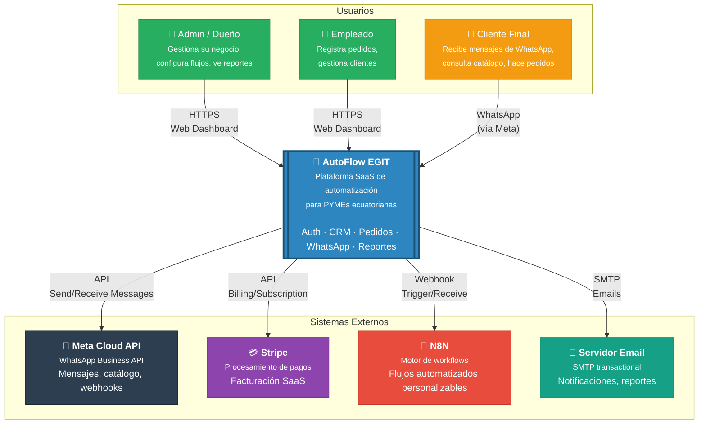
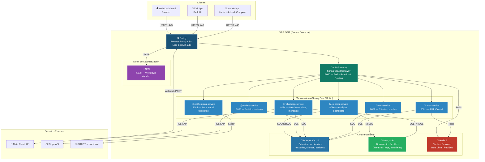

# C4 Context Diagram — AutoFlow EGIT

## Descripción

El **System Context Diagram** muestra AutoFlow como una caja negra, identificando sus usuarios y sistemas externos. Este es el nivel más alto de la vista arquitectónica.

---

## Diagrama C4 Context (Mermaid)



---

## Actores y Sistemas

### Usuarios

| Actor | Plataforma | Descripción |
|-------|-----------|-------------|
| **Admin / Dueño** | Web App | Dueño del negocio. Configura la cuenta, gestiona empleados, ve reportes, define flujos N8N |
| **Empleado** | Web App | Operario del negocio. Registra pedidos, gestiona clientes, envía mensajes de WhatsApp |
| **Cliente Final** | WhatsApp | Cliente del negocio. Recibe catálogo, hace pedidos por WhatsApp, recibe notificaciones |

### Sistemas Externos

| Sistema | Propósito | Integración |
|---------|-----------|-------------|
| **Meta Cloud API** | WhatsApp Business | Envío/recepción de mensajes, catálogo de productos, webhooks entrantes |
| **Stripe** | Pagos SaaS | Suscripciones de clientes de AutoFlow, facturación |
| **N8N** | Workflows automatizados | Motor de automatización self-hosted, ejecuta flujos personalizados por cliente |
| **Servidor Email** | Email transaccional | Notificaciones, reportes semanales, onboarding emails |

---

## Notas de Diseño

1. **El Cliente Final NO interactúa directamente con AutoFlow** — su único canal es WhatsApp. AutoFlow actúa como middleware entre el negocio y su cliente.
2. **N8N está self-hosted** en el mismo VPS de AutoFlow, no es un servicio externo de terceros.
3. **Stripe es el único pago** — se puede reemplazar con pasarela ecuatoriana (Pichincha/Banco del Pacífico) si es necesario.
4. **Multi-tenant es transparente** en este diagrama — cada Admin ve solo su data.

---

## C4 Container Diagram (Vista Expandida)

> ⚠️ **Stack aprobado por Eduardo (ADR-001, 16 Mar 2026):** Microservicios con Spring Boot (Kotlin), apps nativas Android/iOS. Ver [adr-001-stack.md](adr-001-stack.md) y [adr-002-arquitectura.md](adr-002-arquitectura.md).



---

## Flujo de Datos — Ejemplo: Cliente hace pedido por WhatsApp

```
1. Cliente → envía "Quiero 2 pizza margarita" por WhatsApp
2. Meta Cloud API → POST /webhooks/whatsapp → Caddy → API Fastify
3. API → Busca config del tenant → Dispara flujo N8N si existe
4. N8N → Procesa (detecta intención, genera orden)
5. API → Crea Order en PostgreSQL schema del tenant
6. API → Publica en Redis channel "orders:{tenantId}"
7. Socket.io → Push al dashboard del Admin/Empleado: "Nuevo pedido recibido"
8. BullMQ → Job: enviar WhatsApp de confirmación al cliente
9. BullMQ → Job: actualizar métricas del reporte semanal
```

---

*Documentado por Archy — Arquitecto de Software Senior*  
*EGIT Consultoría — AutoFlow v1*
