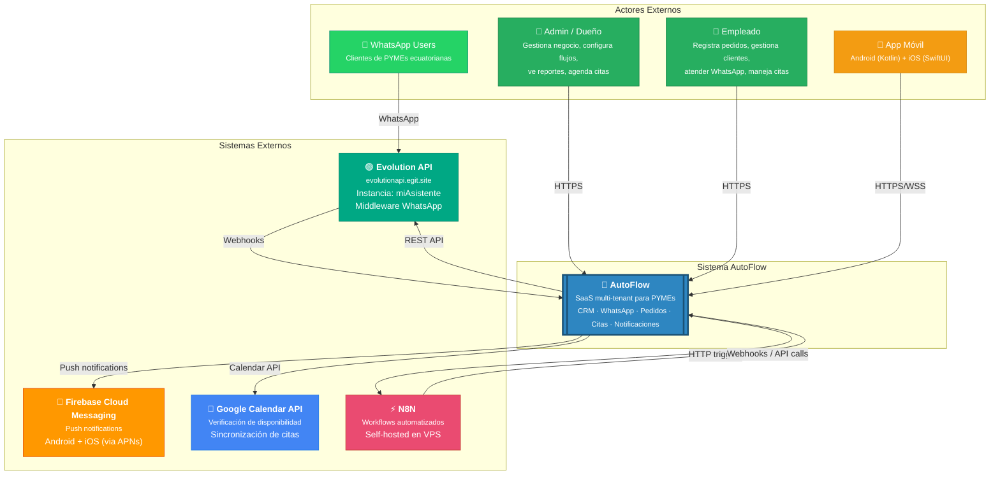
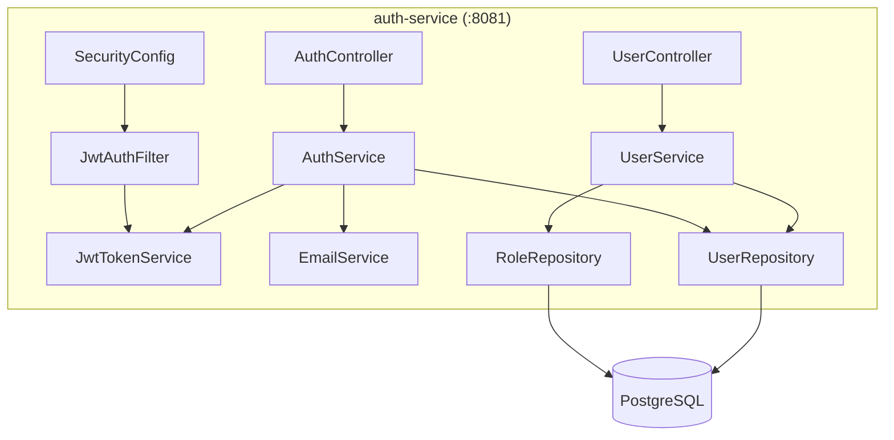
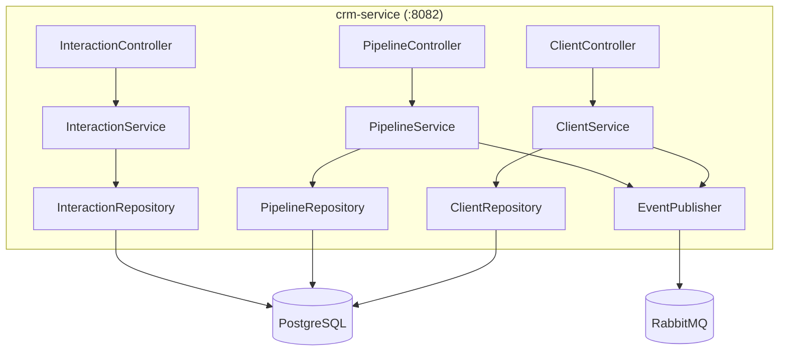
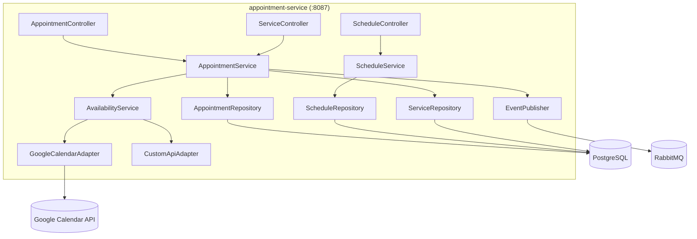
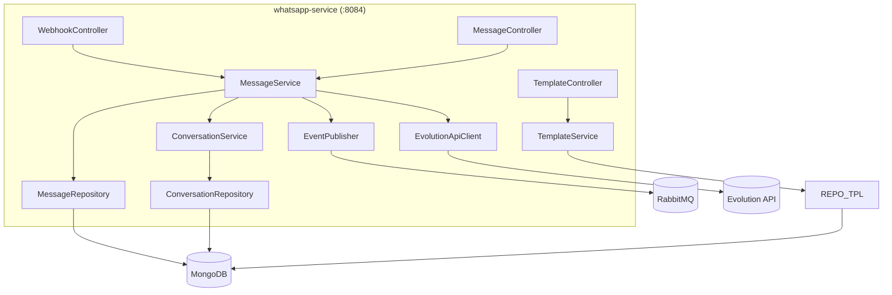
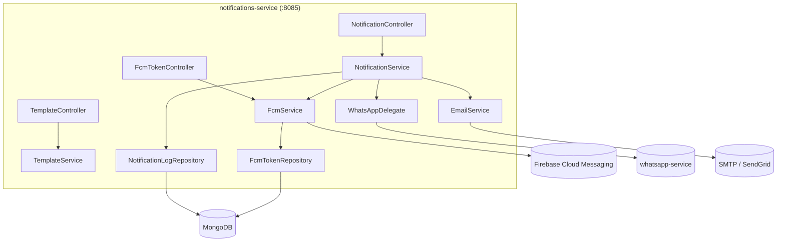

# C4 Diagrams — AutoFlow EGIT

| Campo | Valor |
|-------|-------|
| **Estado** | ✅ Actualizado — Doc (2026-03-17) |
| **Basado en** | ADR-001 Stack v2.0, ADR-002 Arquitectura v2.2 |
| **Servicios** | 8 microservicios: api-gateway, auth-service, crm-service, orders-service, whatsapp-service, notifications-service, reports-service, appointment-service |

---

## 1. Context Diagram — Nivel 1 (L1)

Vista más alta: AutoFlow como caja negra con sus actores y sistemas externos.



### Actores y Sistemas

| Actor | Plataforma | Descripción |
|-------|-----------|-------------|
| **Admin / Dueño** | Web Dashboard + App Móvil | Dueño del negocio. Configura cuenta, gestiona empleados, ve reportes, define flujos N8N, gestiona citas |
| **Empleado** | Web Dashboard + App Móvil | Operario. Registra pedidos, gestiona clientes, atiende WhatsApp, maneja agenda de citas |
| **Cliente Final** | WhatsApp | Cliente del negocio. Recibe catálogo, hace pedidos, reserva citas, recibe notificaciones |
| **App Móvil** | Android (Kotlin + Compose) / iOS (SwiftUI) | App nativa para uso en campo: ventas, entregas, comunicación con clientes |

| Sistema Externo | Propósito | Integración |
|----------------|-----------|-------------|
| **Evolution API** | Middleware WhatsApp | Instancia `miAsistente` en `evolutionapi.egit.site`. Envío/recepción de mensajes, webhooks. **No se usa Meta Cloud API directa.** |
| **Firebase Cloud Messaging** | Push notifications | Android nativo (Firebase SDK) + iOS (APNs via FCM). GRATIS hasta millones de notificaciones/mes. |
| **Google Calendar API** | Disponibilidad de citas | Verificación de slots libres, sincronización bidireccional con calendarios de negocios |
| **N8N** | Workflows automatizados | Self-hosted en el mismo VPS. Flujos configurables sin código por cada cliente |

---

## 2. Container Diagram — Nivel 2 (L2)

Vista de los containers (aplicaciones + data stores) que conforman AutoFlow.

```mermaid
graph TB
    subgraph "Clientes"
        A_APP["📱 Android App<br/><small>Kotlin + Jetpack Compose</small><br/>Firebase SDK (FCM)"]
        I_APP["🍎 iOS App<br/><small>SwiftUI (Swift 6)</small><br/>APNs via FCM"]
        W_DASH["🌐 Web Dashboard<br/><small>Browser (fase futura)</small>"]
    end

    subgraph "VPS EGIT — Docker Compose"
        Caddy["🔒 Caddy<br/><small>Reverse Proxy + SSL</small><br/>Let's Encrypt auto"]
        GW["🔀 API Gateway<br/><small>Spring Cloud Gateway</small><br/>:8080 · Auth · Rate Limit · Routing"]

        subgraph "Microservicios (Spring Boot 3 · Java 21 · Kotlin)"
            AUTH["🔐 auth-service<br/>:8081<br/><small>JWT, OAuth2, RBAC</small>"]
            CRM["👥 crm-service<br/>:8082<br/><small>Clientes, pipeline,<br/>interacciones</small>"]
            ORD["📦 orders-service<br/>:8083<br/><small>Pedidos, estados,<br/>facturación, productos</small>"]
            WPS["💬 whatsapp-service<br/>:8084<br/><small>Evolution API integration,<br/>webhooks, plantillas</small>"]
            NOT["🔔 notifications-service<br/>:8085<br/><small>FCM push, email,<br/>plantillas multi-canal</small>"]
            RPT["📊 reports-service<br/>:8086<br/><small>KPIs, analytics,<br/>export CSV/PDF</small>"]
            APT["📅 appointment-service<br/>:8087<br/><small>Citas, disponibilidad,<br/>recordatorios</small>"]
        end

        subgraph "Motor de Automatización"
            N8N["⚡ N8N<br/>:5678<br/><small>Workflows visuales</small>"]
        end

        subgraph "Almacenamiento"
            PG["🐘 PostgreSQL 17<br/><small>:5432</small><br/>Users, CRM, Orders, Citas<br/><small>Flyway migrations</small>"]
            MDB["🍃 MongoDB 8<br/><small>:27017</small><br/>Mensajes, historiales,<br/>logs, FCM tokens<br/><small>Mongock migrations</small>"]
            RDS["📮 Redis 7<br/><small>:6379</small><br/>Cache, sesiones, rate limit,<br/>distributed locks"]
            RMQ["🐰 RabbitMQ 3.13<br/><small>:5672 / :15672 (UI)</small><br/>Message broker<br/><small>Topic exchange: autoflow.events</small>"]
            MIN["🪣 MinIO<br/><small>:9000 / :9001 (UI)</small><br/>File storage (S3-compatible)<br/>Facturas, media WhatsApp"]
        end
    end

    subgraph "Servicios Externos"
        EVOL_EXT["🟢 Evolution API<br/><small>evolutionapi.egit.site</small><br/>Instancia: miAsistente"]
        FCM_EXT["🔔 Firebase Cloud<br/>Messaging (FCM)"]
        GCAL_EXT["📅 Google Calendar<br/>API"]
    end

    A_APP -->|"HTTPS :443"| Caddy
    I_APP -->|"HTTPS :443"| Caddy
    W_DASH -->|"HTTPS :443"| Caddy
    Caddy --> GW
    Caddy -->|":5678"| N8N

    GW --> AUTH
    GW --> CRM
    GW --> ORD
    GW --> WPS
    GW --> NOT
    GW --> RPT
    GW --> APT
    GW -->|"Redis"| RDS

    AUTH -->|"JDBC"| PG
    CRM -->|"JDBC"| PG
    ORD -->|"JDBC"| PG
    APT -->|"JDBC"| PG
    WPS -->|"MongoDB"| MDB
    WPS -->|"REST"| RMQ
    NOT -->|"MongoDB"| MDB
    NOT -->|"REST"| RMQ
    RPT -->|"JDBC"| PG
    RPT -->|"MongoDB"| MDB
    AUTH -->|"Redis"| RDS

    WPS -->|"REST API"| EVOL_EXT
    EVOL_EXT -->|"Webhook POST"| Caddy
    NOT -->|"Admin SDK"| FCM_EXT
    APT -->|"REST API"| GCAL_EXT
    WPS -->|"S3 API"| MIN
    ORD -->|"S3 API"| MIN

    style Caddy fill:#1a5276,stroke:#fff,color:#fff
    style GW fill:#117a65,stroke:#fff,color:#fff
    style AUTH fill:#2e86c1,stroke:#fff,color:#fff
    style CRM fill:#2e86c1,stroke:#fff,color:#fff
    style ORD fill:#2e86c1,stroke:#fff,color:#fff
    style WPS fill:#2e86c1,stroke:#fff,color:#fff
    style NOT fill:#2e86c1,stroke:#fff,color:#fff
    style RPT fill:#2e86c1,stroke:#fff,color:#fff
    style APT fill:#2e86c1,stroke:#fff,color:#fff
    style N8N fill:#ea4b71,stroke:#fff,color:#fff
    style PG fill:#2874a6,stroke:#fff,color:#fff
    style MDB fill:#27ae60,stroke:#fff,color:#fff
    style RDS fill:#c0392b,stroke:#fff,color:#fff
    style RMQ fill:#ff6600,stroke:#fff,color:#fff
    style MIN fill:#c74634,stroke:#fff,color:#fff
```



### Resumen de Containers

| Container | Tecnología | Puerto | Base de Datos |
|-----------|-----------|--------|---------------|
| **api-gateway** | Spring Cloud Gateway | 8080 | Redis (rate limit) |
| **auth-service** | Spring Boot 3 + Spring Security | 8081 | PostgreSQL |
| **crm-service** | Spring Boot 3 + Spring Data JPA | 8082 | PostgreSQL |
| **orders-service** | Spring Boot 3 + Spring Data JPA | 8083 | PostgreSQL |
| **whatsapp-service** | Spring Boot 3 + WebClient | 8084 | MongoDB |
| **notifications-service** | Spring Boot 3 + Firebase Admin SDK | 8085 | MongoDB |
| **reports-service** | Spring Boot 3 + JPA + MongoDB | 8086 | PostgreSQL + MongoDB |
| **appointment-service** | Spring Boot 3 + Spring Data JPA | 8087 | PostgreSQL |
| **n8n** | N8N (self-hosted) | 5678 | PostgreSQL (interna) |
| **PostgreSQL** | PostgreSQL 17 | 5432 | — |
| **MongoDB** | MongoDB 8 | 27017 | — |
| **Redis** | Redis 7.4 | 6379 | — |
| **RabbitMQ** | RabbitMQ 3.13 (management) | 5672 / 15672 | — |
| **MinIO** | MinIO (S3-compatible) | 9000 / 9001 | — |

---

## 3. Component Diagrams — Nivel 3 (L3)

### 3.1 auth-service



| Componente | Responsabilidad |
|------------|----------------|
| `AuthController` | Endpoints `/auth/login`, `/auth/register`, `/auth/refresh` |
| `UserController` | CRUD usuarios, gestión de roles |
| `AuthService` | Lógica de autenticación, validación de credenciales |
| `JwtTokenService` | Generación, validación y refresh de JWT (RSA-256) |
| `EmailService` | Verificación de email, password reset |
| `SecurityConfig` | Configuración Spring Security, rutas públicas/privadas |
| `JwtAuthFilter` | Filtro JWT para validación de tokens entrantes |

---

### 3.2 crm-service



| Componente | Responsabilidad |
|------------|----------------|
| `ClientController` | CRUD clientes, búsqueda avanzada, etiquetado |
| `PipelineController` | Etapas de ventas, pipeline por tenant |
| `InteractionController` | Historial de interacciones (llamadas, mensajes, emails) |
| `ClientService` | Lógica de negocio: segmentación, scoring |
| `PipelineService` | Gestión de etapas, transiciones, reportes de pipeline |
| `InteractionService` | Registro y consulta de interacciones |
| `EventPublisher` | Publica eventos `client.updated` a RabbitMQ |

---

### 3.3 appointment-service



| Componente | Responsabilidad |
|------------|----------------|
| `AppointmentController` | CRUD citas, cancelación, reprogramación |
| `ScheduleController` | Horarios de atención por tenant |
| `ServiceController` | Tipos de servicio (duración, precio, buffer) |
| `AppointmentService` | Lógica de creación, confirmación, cancelación de citas |
| `ScheduleService` | Gestión de horarios, excepciones, feriados |
| `AvailabilityService` | Verificación de disponibilidad en tiempo real |
| `GoogleCalendarAdapter` | Adaptador para Google Calendar API (freebusy, events) |
| `CustomApiAdapter` | Adaptador genérico para APIs propias de terceros |
| `EventPublisher` | Publica `appointment.created`, `.cancelled`, `.reminder` |

---

### 3.4 whatsapp-service



| Componente | Responsabilidad |
|------------|----------------|
| `WebhookController` | Recibe webhooks entrantes de Evolution API |
| `MessageController` | Envío de mensajes salientes y con media |
| `TemplateController` | CRUD de plantillas de mensaje por tenant |
| `MessageService` | Lógica de envío/recepción, formato, validación |
| `ConversationService` | Gestión de conversaciones, contexto multi-turno |
| `EvolutionApiClient` | Cliente HTTP para REST API de Evolution API |
| `EventPublisher` | Publica `message.received`, `message.delivered` |

---

### 3.5 notifications-service



| Componente | Responsabilidad |
|------------|----------------|
| `NotificationController` | Envío de notificaciones, consulta de estado |
| `FcmTokenController` | Registro/baja de tokens de dispositivos móviles |
| `TemplateController` | Plantillas de notificación por canal (email, push, WhatsApp) |
| `NotificationService` | Orquestador: decide canal y coordina envío |
| `FcmService` | Envío de push via Firebase Admin SDK (individual, topic, multicast) |
| `EmailService` | Envío de emails transaccionales |
| `WhatsAppDelegate` | Delega a `whatsapp-service` para notificaciones WhatsApp |
| `FcmTokenRepository` | Gestión de tokens FCM con TTL automático |

---

## 4. Flujo de Datos — Ejemplos

### 4.1 Flujo WhatsApp (Mensaje entrante)

```
Cliente WhatsApp
  → Evolution API (evolutionapi.egit.site, inst. miAsistente)
  → Webhook POST → Caddy → whatsapp-service (:8084)
  → Guarda mensaje en MongoDB (conversación)
  → Publica evento message.received en RabbitMQ (topic: autoflow.events)
  → crm-service actualiza historial de interacciones del cliente
  → notifications-service envía push al agente (FCM)
```

### 4.2 Flujo Reserva de Cita

```
Cliente/App → API Gateway → appointment-service (:8087)
  → availabilityService.verificarDisponibilidad()
    → Google Calendar API (GET /freebusy)
    → Custom API del negocio (si configurado)
  → Si disponible: crea cita en PostgreSQL (estado CONFIRMED)
  → Publica appointment.created en RabbitMQ
  → notifications-service:
    → WhatsApp confirmación (via whatsapp-service → Evolution API)
    → Push notification (FCM)
  → N8N programa recordatorios (24h y 2h antes)
```

### 4.3 Flujo Push Notification

```
Evento interno (mensaje nuevo, cita creada, pedido actualizado)
  → notifications-service
  → Firebase Cloud Messaging (FCM Admin SDK)
  → Android App (Firebase SDK directo)
  → iOS App (FCM → APNs bridge)
```

---

## 5. Arquitectura de Red Docker

```
autoflow-network (bridge)
├── autoflow-gateway    :8080
├── autoflow-auth       :8081
├── autoflow-crm        :8082
├── autoflow-orders     :8083
├── autoflow-whatsapp   :8084
├── autoflow-notifications :8085
├── autoflow-reports    :8086
├── autoflow-appointments :8087
├── autoflow-n8n        :5678
├── autoflow-postgres   :5432
├── autoflow-mongo      :27017
├── autoflow-redis      :6379
├── autoflow-rabbitmq   :5672  (:15672 management)
└── autoflow-minio      :9000  (:9001 console)

Servicios externos (no en red Docker):
  - Evolution API: evolutionapi.egit.site (EGIT separate)
  - FCM: fcm.googleapis.com
  - Google Calendar API: www.googleapis.com
```

Cada microservicio se comunica con los demás usando el **hostname del contenedor** como DNS interno de Docker. Ejemplo: `http://autoflow-auth:8081` desde cualquier otro servicio en `autoflow-network`.

---

*Documentado por Doc — Documentador de Arquitectura, EGIT Consultoría*  
*Actualizado: 17 Marzo 2026 · Basado en ADR-001 v2.0 y ADR-002 v2.2*
